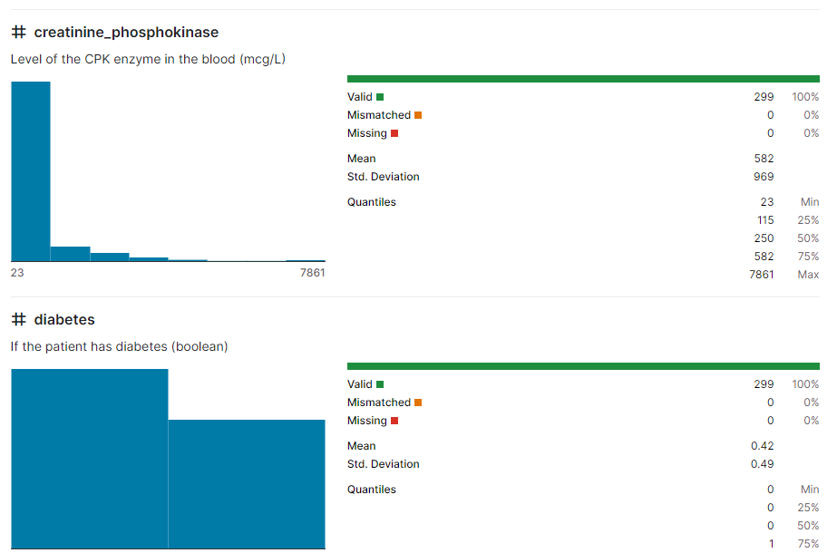

# Capstone Project - Azure Machine Learning Engineer - Thang Tran

This project, I will create two models: one using Automated ML (denoted as AutoML from now on) and one customized model whose hyperparameters are tuned using HyperDrive. I will then compare the performance of both the models and deploy the best performing model.

## Project Workflow

## Dataset: Heart Failure Prediction

The link dataset from Kaggle: [Heart Failure Prediction](https://www.kaggle.com/andrewmvd/heart-failure-clinical-data) 

### Overview

Cardiovascular diseases (CVDs) are the **number 1 cause of death globally**, taking an estimated **17.9 million lives each year**, which accounts for **31% of all deaths worlwide**.  
Heart failure is a common event caused by CVDs and this dataset contains 12 features that can be used to predict mortality by heart failure.

Most cardiovascular diseases can be prevented by addressing behavioural risk factors such as tobacco use, unhealthy diet and obesity, physical inactivity and harmful use of alcohol using population-wide strategies.

People with cardiovascular disease or who are at high cardiovascular risk (due to the presence of one or more risk factors such as hypertension, diabetes, hyperlipidaemia or already established disease) need **early detection** and management wherein a machine learning model can be of great help.

**This dataset contains the following features:**

### Task

At the end of this task, I will have finished training models on the dataset and deployed the best model.

### Access

The dataset is hosted [here](https://raw.githubusercontent.com/thangtranquang/Azure-Machine-Learning-Engineer-2023/main/data/heart_failure_clinical_records_dataset.csv) . I will use the ` Dataset.Tabular.from_delimited_files()` to get the data from the url and save it to the datastore by using dataset.register().

## Automated ML

Automated ML select an algorithm and hyperparameters and generates a model ready for deployment model

### Results

The best performing model is the `VotingEnsemble` with an Accuracy value of **0.87054**.

Best Model

### Improve AutoML

* Engineer more new features to improve model performance..
* Explore other AutoML configurations.

## Hyperparameter Tuning

I tried LogisticRegression for this experiment. Since this model is simple to understand and also handle both categorical and numerical data for this classification task.

### Results

## Model Deployment

The AutoML model outperforms than the HyperDrive model, So

 I will have to deploy your best model as a webservice and test the model endpoint

## Screen Recording

[Video Link](https://www.loom.com/share/a8eb241bde0a4413853735e25c5df876)

## Standout Suggestions

* Engineer more new features to improve model performance..
* Explore other AutoML configurations.
